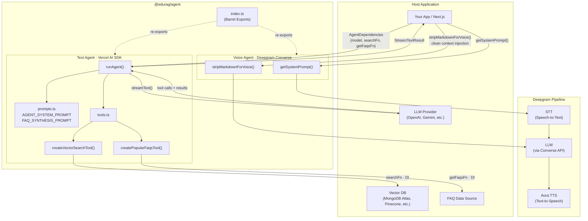

# @edurag/agent

The AI agent powering [EduRAG](https://github.com/lord-dubious/edurag) — a self-hostable RAG knowledge base for universities. This package contains the text chat agent and voice agent logic, designed to work with any vector database and LLM provider through dependency injection.

## Architecture

```
src/
├── index.ts              # Barrel re-exports
├── text/                 # Text Chat Agent (Vercel AI SDK)
│   ├── index.ts          # runAgent() orchestrator
│   ├── prompts.ts        # System prompts & constants
│   ├── tools.ts          # vector_search & FAQ tools (DI-based)
│   └── types.ts          # TypeScript interfaces
└── voice/                # Voice Agent (Deepgram Converse + Aura TTS)
    ├── index.ts          # stripMarkdownForVoice(), getSystemPrompt()
    └── types.ts          # Voice-specific types
```

### System Diagram



## How It Works

### Text Agent

The text agent uses the [Vercel AI SDK](https://ai-sdk.dev) to orchestrate an LLM with tool calling. It has two built-in tools:

- **`vector_search`** — Searches a knowledge base for relevant documents
- **`get_popular_faqs`** — Retrieves frequently asked questions

Both tools use **dependency injection** — they accept functions instead of importing database clients directly. This makes the agent portable across any vector store (MongoDB Atlas, Pinecone, Weaviate, etc.).

```typescript
import { createVectorSearchTool, runAgent } from '@edurag/agent/text';
import type { AgentDependencies } from '@edurag/agent/text';

// Wire your own search implementation
const tool = createVectorSearchTool(async (query, topK) => {
  // Your vector DB search here
  return results;
});

// Run the agent with your model
const deps: AgentDependencies = {
  model: yourLLMModel,
  searchFn: yourSearchFunction,
  getFaqsFn: yourFaqFunction,
  maxSteps: 5,
  maxTokens: 32000,
};

const result = await runAgent(deps, {
  messages: uiMessages,
  threadId: 'thread-123',
  universityName: 'MIT',
});
```

### Voice Agent

The voice agent is designed for [Deepgram's Converse WebSocket API](https://developers.deepgram.com/docs/voice-agent-overview), which connects:

1. **Deepgram STT** (Speech-to-Text) for listening
2. **Any LLM** (Gemini, GPT, etc.) for thinking
3. **Deepgram Aura TTS** (Text-to-Speech) for speaking

Since Deepgram pipes LLM output directly to TTS with no intermediate processing, the voice agent includes:

- **`getSystemPrompt()`** — A strict no-markdown prompt optimized for natural speech
- **`stripMarkdownForVoice()`** — Regex-based markdown cleaner for injected context

```typescript
import { getSystemPrompt, stripMarkdownForVoice } from '@edurag/agent/voice';

// Use in Deepgram Converse settings
const prompt = getSystemPrompt('Harvard University');

// Clean any markdown from context before injecting into the voice pipeline
const clean = stripMarkdownForVoice(rawDatabaseContent);
```

## Installation

### As a Git Submodule (Recommended)

```bash
cd your-project
git submodule add https://github.com/lord-dubious/edurag-agent.git packages/agent
```

Then add to your `package.json`:

```json
{
  "workspaces": ["packages/*"]
}
```

And your `tsconfig.json`:

```json
{
  "compilerOptions": {
    "paths": {
      "@edurag/agent": ["./packages/agent/src"],
      "@edurag/agent/*": ["./packages/agent/src/*"]
    }
  }
}
```

For Next.js, add to `next.config.ts`:

```typescript
const nextConfig: NextConfig = {
  transpilePackages: ['@edurag/agent'],
};
```

## API Reference

### Text Agent (`@edurag/agent/text`)

| Export | Type | Description |
|--------|------|-------------|
| `runAgent(deps, options)` | Function | Main orchestrator — streams LLM response with tool calls |
| `createVectorSearchTool(searchFn)` | Function | Creates a vector search tool with your search implementation |
| `createPopularFaqsTool(getFaqsFn)` | Function | Creates a FAQ tool with your FAQ data source |
| `cleanForDisplay(content)` | Function | Normalizes whitespace in content strings |
| `AGENT_SYSTEM_PROMPT` | Constant | The main system prompt template |
| `FAQ_SYNTHESIS_PROMPT` | Constant | Prompt for auto-generating FAQ answers |
| `DEFAULT_CRAWL_INSTRUCTIONS` | Constant | Default instructions for web crawling |

### Voice Agent (`@edurag/agent/voice`)

| Export | Type | Description |
|--------|------|-------------|
| `getSystemPrompt(name?)` | Function | Generates a TTS-optimized system prompt |
| `stripMarkdownForVoice(text)` | Function | Removes all markdown formatting from text |

### Types (`@edurag/agent/text/types`)

| Type | Description |
|------|-------------|
| `AgentOptions` | Options for `runAgent()` (messages, threadId, etc.) |
| `AgentDependencies` | Dependencies injected into `runAgent()` |
| `Source` | A source document reference |
| `VectorSearchResult` | A search result with content, URL, title, score |
| `ToolResult` | Return type of vector_search tool |
| `SimilaritySearchFn` | Type signature for the search function |
| `GetPublicFaqsFn` | Type signature for the FAQ function |

### Types (`@edurag/agent/voice/types`)

| Type | Description |
|------|-------------|
| `VoiceMessage` | A voice conversation message |
| `VoiceConversation` | A full voice conversation session |
| `VectorSearchFunctionArgs` | Args for the voice search function |
| `VoiceVectorSearchResult` | Voice-specific search result |

## Customization

### Changing the System Prompt

Edit `src/text/prompts.ts` to customize the text agent's behavior. The prompt uses `{UNIVERSITY_NAME}` and `{CURRENT_DATE}` as template placeholders.

### Adding New Tools

Create new tools in `src/text/tools.ts` using the [Vercel AI SDK `tool()` function](https://ai-sdk.dev/docs/ai-sdk-core/tools-and-tool-calling):

```typescript
import { tool } from 'ai';
import { z } from 'zod';

export const createMyTool = (myDep: MyDepType) =>
  tool({
    description: 'What this tool does',
    inputSchema: z.object({ query: z.string() }),
    execute: async ({ query }) => {
      return await myDep.search(query);
    },
  });
```

### Voice Prompt Tuning

Edit `src/voice/index.ts` to adjust the voice agent's personality, speech rules, or search behavior. The prompt is specifically designed to prevent markdown from being read aloud by TTS engines.

## Peer Dependencies

| Package | Version | Used For |
|---------|---------|----------|
| `ai` | `>=6.0.0` | Vercel AI SDK — `streamText`, `tool`, `convertToModelMessages` |
| `zod` | `>=4.0.0` | Schema validation for tool inputs |

## License

MIT
